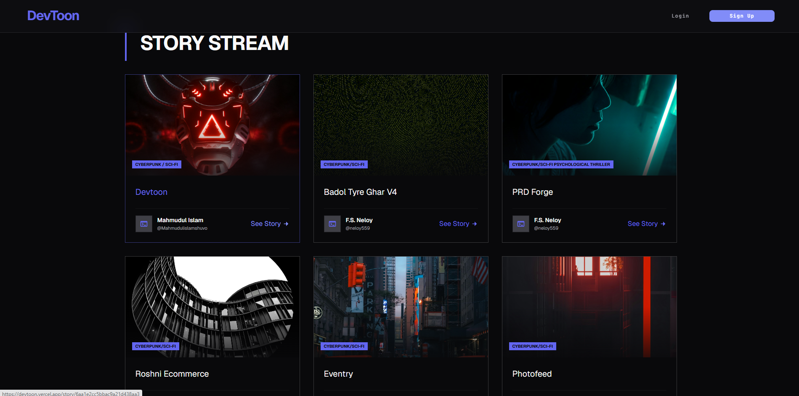

<div align="center">
  

# 📚 Devtoon

**An immersive platform for discovering and reading interactive stories.**

[](https://nextjs.org/)
[](https://mongodb.com)
[](https://tailwindcss.com/)
[](LICENSE)

</div>

<br />

## 🌟 About The Project

**Devtoon** is a modern, fast, and scalable story-reading platform built with the latest web technologies. It provides a seamless reading experience with features like infinite scrolling, interactive page-flipping, and a beautiful user interface powered by Next.js and Tailwind CSS.

Whether you're an author looking to publish your work or a reader discovering new tales, Devtoon offers a premium digital reading environment.

## 🚀 Key Features

- **📖 Story Stream:** Infinite scrolling for a smooth and uninterrupted story discovery experience.
- **🔐 Secure Authentication:** Complete login and registration system using `NextAuth.js` and `bcryptjs`.
- **🎨 Beautiful UI:** Fully responsive and accessible design crafted with Tailwind CSS v4 and Framer Motion animations.
- **📄 Interactive Reading:** Page flip effects for a realistic reading feel (powered by `react-pageflip`).
- **⚡ High Performance:** Server-Side Rendering (SSR) and Server Actions via Next.js App Router for optimal SEO and speed.
- **💾 Robust Database:** MongoDB and Mongoose for scalable data management.

## 💻 Tech Stack

### Frontend

- **Framework:** Next.js (App Router)
- **Styling:** Tailwind CSS v4
- **Animations:** Framer Motion
- **State Management:** React Query (`@tanstack/react-query`)
- **UI Components:** React Icons, React Pageflip

### Backend

- **Database:** MongoDB
- **ORM/ODM:** Mongoose
- **Authentication:** NextAuth.js, JSON Web Tokens (JWT)

## ⚙️ Local Development Setup

Follow these steps to set up Devtoon on your local machine.

### 1. Prerequisites

- [Node.js](https://nodejs.org/) (v18 or higher)
- [Git](https://git-scm.com/)
- A MongoDB cluster (or local instance)

### 2. Clone the repository

```bash
git clone https://github.com/Mahmudulislamshuvo/devtoon
cd devton
```

### 3. Install Dependencies

```bash
npm install
```

### 4. Configure Environment Variables

Create a `.env` file in the root of your project and add the following keys:

```env
# MongoDB Connection String
MONGODB_URI=mongodb+srv://<username>:<password>@cluster.mongodb.net/devtoon

# NextAuth Configuration
NEXTAUTH_SECRET=generate_a_random_secret_string_here
NEXTAUTH_URL=http://localhost:3000

# Additional Keys (if any)
# ...
```

### 5. Run the Development Server

```bash
npm run dev
```

Open [http://localhost:3000](http://localhost:3000) to view it in your browser.

## 📂 Project Structure

```bash
devton/
├── actions/        # Next.js Server Actions for database mutations
├── app/            # App Router pages (login, register, story, api routes)
├── components/     # Reusable UI components (skeletons, home CTA, etc.)
├── lib/            # Utility functions and DB connection setup
├── models/         # Mongoose schemas (Story, User, CommitCache)
├── public/         # Static assets (icons, images)
└── utils/          # Helper methods and utilities
```

## 🤝 Contributing

We welcome contributions to Devtoon!

1. Fork the Project
2. Create your Feature Branch (`git checkout -b feature/AmazingFeature`)
3. Commit your Changes (`git commit -m 'Add some AmazingFeature'`)
4. Push to the Branch (`git push origin feature/AmazingFeature`)
5. Open a Pull Request

## 🛡️ License

Distributed under the MIT License. See `LICENSE` for more information.

<div align="center">
  <br />
  <sub>Built with ❤️ by [Mahmudul Islam]</sub>
</div>
